# Hanlin Zhao (Zhao Hanlin)

I build agent products that meet users at the point of action — the input field, the desktop app, the browser, the workflow they already use. The thesis is simple: the most useful agents are not separate chat rooms. They capture intent, use context, plan, call tools, execute across real software, and write results back where the work continues.

At Z.ai, I lead [AutoClaw](https://autoglm.zhipuai.cn/autoclaw/), [AutoTyper](https://autoglm.zhipuai.cn/autotyper/) (Zhipu AI Input Method), and the [GLM-ASR](https://github.com/zai-org/GLM-ASR) / [GLM-ASR-Nano](https://huggingface.co/zai-org/GLM-ASR-Nano-2512) speech model lines.

## Selected Work

- **[AutoClaw](https://autoglm.zhipuai.cn/autoclaw/)** — desktop AI agent that turns the user's computer into an execution environment. Cloud/local runtime, model routing, tool & MCP integrations, memory, browser control, multi-device continuity.
- **[AutoTyper](https://autoglm.zhipuai.cn/autotyper/)** — voice-first writing and agent execution inside everyday input fields. Speech-to-text, in-place LLM editing, translation, tone control, structured writeback.
- **[GLM-ASR](https://github.com/zai-org/GLM-ASR) / [GLM-ASR-Nano](https://huggingface.co/zai-org/GLM-ASR-Nano-2512)** — robust speech recognition for real-world Chinese and multilingual speech. Nano crossed 1M downloads on Hugging Face.
- **[NaturalCodeBench](https://aclanthology.org/2024.findings-acl.471/)** (ACL 2024 Findings) — evaluating code generation on natural user prompts.
- **[AutoGLM](https://arxiv.org/abs/2411.00820)** & **[VisualAgentBench](https://arxiv.org/abs/2408.06327)** — GUI agents and agent evaluation.
- **[ChatGLM report](https://arxiv.org/abs/2406.12793)** — model development and evaluation.

## Currently

Running four coding agents in parallel as daily drivers — OpenCode for builds, Codex for review, Claude Code for design, OpenClaw as the experiment harness — and shipping AutoClaw kernel updates against the logs from all four.

Auto-tracked across Claude Code, Codex, OpenCode, and the OpenClaw family via [tokscale](https://github.com/junhoyeo/tokscale) plus a small local collector. Cost figure is LiteLLM bench pricing, not an actual bill.

---

Talk to me about **desktop agents · voice-first writing · agent evaluation**.

📫 hanlin9908@gmail.com · 🎓 [Google Scholar](https://scholar.google.com/citations?user=2sVac3EAAAAJ&hl=zh-CN)
